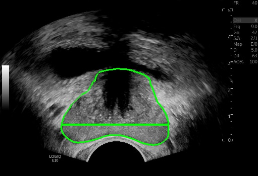
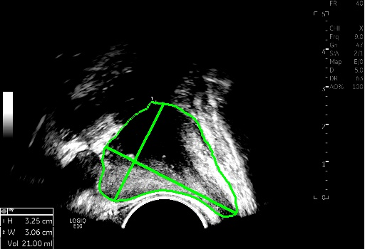

# 2020design_project
prostate segmentation

## Original Prostate Dataset
자신에 맞는 경로 수정 필요!
```
inputs
└── <dataset name>
    ├── 0004
    |    ├── DICOM
    │    │    ├── IN_00256_0000224.dcm
    │    │    ├── IN_00256_0000225.dcm
    │    │    ├── IN_00256_0000226.dcm
    │    │    ├── ...
    │    │
    │    ├── MASK
    │    │    ├── lesionAnnot2D-001.nii.gz
    │    │    ├── lesionAnnot2D-002.nii.gz
    │    │    ├── lesionAnnot2D-003.nii.gz
    │    │    ├── ...
    │    │
    |    └── lesionAnnot2D.json
    │
    ├── 0005
    |    ├── DICOM
    │    │    ├── IN_00256_0000224.dcm
    │    │    ├── IN_00256_0000225.dcm
    │    │    ├── IN_00256_0000226.dcm
    │    │    ├── ...
    │    │
    │    ├── MASK
    │    │    ├── lesionAnnot2D-001.nii.gz
    │    │    ├── lesionAnnot2D-002.nii.gz
    │    │    ├── lesionAnnot2D-003.nii.gz
    │    │    ├── ...
    │    │
    |    └── lesionAnnot2D.json
    ├── 0006
    |    ├── DICOM
    │    │    ├── IN_00256_0000224.dcm
    │    │    ├── IN_00256_0000225.dcm
    │    │    ├── IN_00256_0000226.dcm
    │    │    ├── ...
    │    │
    │    ├── MASK
    │    │    ├── lesionAnnot2D-001.nii.gz
    │    │    ├── lesionAnnot2D-002.nii.gz
    │    │    ├── lesionAnnot2D-003.nii.gz
    │    │    ├── ...
    │    │
    |    └── lesionAnnot2D.json
    │
    ├── ...

```

## After data_preprocessing
```
inputs
└── <dataset name>
    ├── images
    |   ├── A_0004_00.png
    │   ├── A_0004_01.png
    │   ├── S_0004_02.png
    │   ├── ...
    |
    └── masks
        └── 0
            ├── A_0004_00.png
            ├── A_0004_01.png
            ├── S_0004_02.png
            ├── ...
            
```
## Train
Contour Segmentation
Nested Unet (Unet++)
자신에 맞는 경로 및 image input size(x16n) 수정 필요!

## Test output
```
output
└── <dataset name>
      └── 0
          ├── A_0096_00.png
          ├── A_0096_01.png
          ├── S_0096_02.png
          ├── ...
            
```

## Select max_surface Axial, Sagittal
```
output
└── <dataset name_selected>
      ├── 0096
      |    ├── 0
      |    |   └── A_0096_06.png
      |    └── 1
      |        └── S_0096_12.png
      ├── 0111
      |    ├── 0
      |    |   └── A_0111_07.png
      |    └── 1
      |        └── S_0111_11.png
      ├── ...
```

## Measuring Algorithm
line_scan.py & find_maximum_length.py




